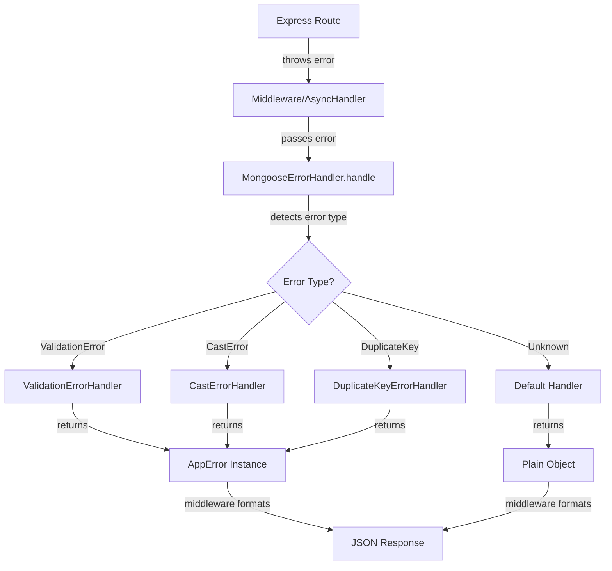
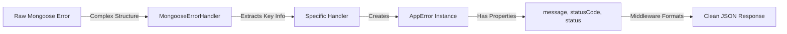
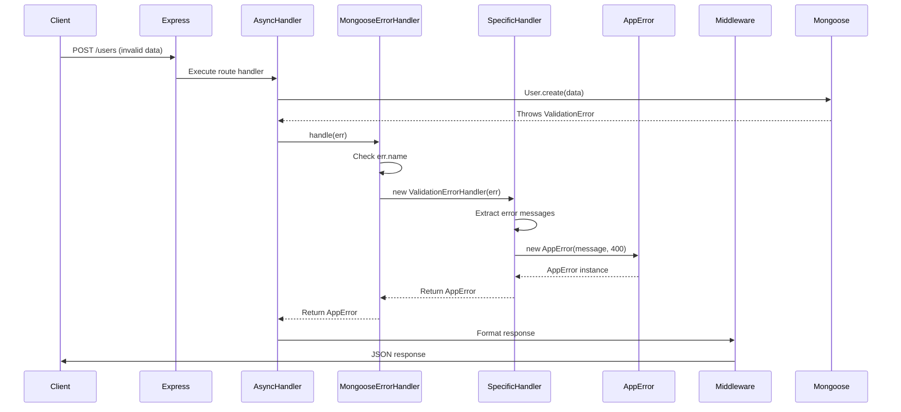

# Mongoose Error Handler - Deep Dive Documentation

## 📚 Table of Contents
1. [Architecture Overview](#architecture-overview)
2. [Core Components](#core-components)
3. [Execution Flow](#execution-flow)
4. [Error Detection Logic](#error-detection-logic)
5. [Error Transformation Process](#error-transformation-process)
6. [Response Structure](#response-structure)
7. [Advanced Concepts](#advanced-concepts)

---

## 🏗️ Architecture Overview

This library follows a **Handler Pattern** with a **Factory-like approach** to transform raw Mongoose errors into structured, user-friendly API responses.



---

## 🧩 Core Components

### 1. **AppError Class** (`appError/errorHandlers.js`)

The foundation of the error system. This is a **custom error class** that extends JavaScript's native `Error`.

```javascript
class AppError extends Error {
  constructor(message, statusCode) {
    super(message);                    // Call parent Error constructor
    this.status = statusCode.toString().startsWith("4") ? "fail" : "error";
    this.statusCode = statusCode;
    this.isOperational = true;
    Error.captureStackTrace(this, this.constructor);
  }
}
```

**Deep Understanding:**

- **`super(message)`**: Calls the native Error constructor to set the error message
- **`this.status`**: Smart categorization
  - If statusCode starts with "4" (400-499) → `"fail"` (client error)
  - Otherwise (500-599) → `"error"` (server error)
- **`this.statusCode`**: HTTP status code (400, 404, 500, etc.)
- **`this.isOperational`**: Flag to distinguish operational errors (expected) from programming errors (bugs)
- **`Error.captureStackTrace()`**: Captures the stack trace and removes the constructor call from it, making debugging cleaner

---

### 2. **Error Type Constants** (`constants/errorTypes.js`)

Centralized error type definitions to avoid magic strings.

```javascript
const ERROR_TYPES = Object.freeze({
  CAST_ERROR: "CastError",
  VALIDATION_ERROR: "ValidationError",
  DUPLICATE_KEY: ["11000", "MongoServerError"],
  UNHNADLEDREJECTION: "unhandledRejection",
  REJECTEDHANDLED: "rejectedhandled", 
});
```

**Why `Object.freeze()`?**
- Prevents modification of the constants at runtime
- Ensures type safety and consistency across the library

**DUPLICATE_KEY Array:**
- `[0]`: Error code (`"11000"` - MongoDB's duplicate key error code)
- `[1]`: Error name (`"MongoServerError"` - the error type name)

---

### 3. **MongooseErrorHandler** (`index.js`)

The **main orchestrator** that routes errors to their specific handlers.

```javascript
class MongooseErrorHandler {
  static handle(err) {
    if (err.name === ERROR_TYPES.VALIDATION_ERROR) {
      return new ValidationErrorHandler(err).handleValidationError(err);
    } else if (err instanceof mongoose.CastError) {
      return new CastErrorHandler(err).handleCastError(err);
    } else if (err.name === ERROR_TYPES.DUPLICATE_KEY[1] && err.code && err.code.toString() === ERROR_TYPES.DUPLICATE_KEY[0]) {
      return new DuplicateKeyErrorHandler(err).handleDuplicateKeyError(err);
    } else {
      return {
        type: "unknown",
        message: err.message || "Something went wrong",
      };
    }
  }
}
```

**Detection Strategy:**

1. **ValidationError**: Uses `err.name === "ValidationError"`
2. **CastError**: Uses `err instanceof mongoose.CastError` (more reliable than name check)
3. **DuplicateKeyError**: Checks both `err.name === "MongoServerError"` AND `err.code === "11000"`
4. **Unknown**: Fallback for any unrecognized error

**Why `instanceof` for CastError?**
- More robust than string comparison
- Ensures the error is truly a Mongoose CastError instance
- Protects against name collisions

---

### 4. **Specific Error Handlers** (`errors/`)

Each handler follows the same pattern:

#### **ValidationErrorHandler** (`errors/ValidationError.js`)

Handles schema validation failures (required fields, type mismatches, custom validators).

```javascript
class ValidationErrorHandler {
  constructor(err) {
    this.type = ERROR_TYPES.VALIDATION_ERROR;
    this.message = err.message;
    this.errors = err.errors;
  }

  handleValidationError(err) {
    if (!err.errors) {
      return new AppError(`Validation error: ${err.message || 'Unknown validation error'}`, 400);
    }
    const errors = Object.values(err.errors)
      .map((e) => e.message)
      .join(", ");
    return new AppError(`Validation error: ${errors}`, 400);
  }
}
```

**Flow:**
1. Check if `err.errors` exists (Mongoose validation errors have this property)
2. Extract all error messages from the `errors` object
3. Join them into a single readable string
4. Return an `AppError` with status code 400

**Example Mongoose Error:**
```javascript
{
  name: "ValidationError",
  errors: {
    email: { message: "Email is required" },
    age: { message: "Age must be at least 18" }
  }
}
```

**Transformed Output:**
```javascript
AppError {
  message: "Validation error: Email is required, Age must be at least 18",
  statusCode: 400,
  status: "fail"
}
```

---

#### **CastErrorHandler** (`errors/CastError.js`)

Handles invalid data type conversions (e.g., invalid ObjectId, wrong type).

```javascript
class CastErrorHandler {
  constructor(err) {
    this.type = ERROR_TYPES.CAST_ERROR;
  }

  handleCastError(err) {
    const message = `Invalid ${err.path}: ${err.value}`;
    return new AppError(message, 400);
  }
}
```

**Flow:**
1. Extract the field name (`err.path`) and invalid value (`err.value`)
2. Create a descriptive message
3. Return an `AppError` with status code 400

**Example Mongoose Error:**
```javascript
{
  name: "CastError",
  path: "_id",
  value: "invalid-id-123"
}
```

**Transformed Output:**
```javascript
AppError {
  message: "Invalid _id: invalid-id-123",
  statusCode: 400,
  status: "fail"
}
```

---

#### **DuplicateKeyErrorHandler** (`errors/DuplicateKeyError.js`)

Handles MongoDB unique constraint violations.

```javascript
class DuplicateKeyErrorHandler {
  constructor(err) {
    this.type = ERROR_TYPES.DUPLICATE_KEY[1];
    this.keyValue = err.keyValue;
  }

  handleDuplicateKeyError(err) {
    if (!err.keyValue) {
      return new AppError('Duplicate field value entered', 400);
    }
    const value = Object.keys(err.keyValue)[0];
    return new AppError(
      `Duplicate field value: ${value}. Please use another one!`,
      400
    );
  }
}
```

**Flow:**
1. Check if `err.keyValue` exists (contains the duplicate field)
2. Extract the field name from `keyValue` object
3. Create a user-friendly message
4. Return an `AppError` with status code 400

**Example Mongoose Error:**
```javascript
{
  name: "MongoServerError",
  code: 11000,
  keyValue: { email: "user@example.com" }
}
```

**Transformed Output:**
```javascript
AppError {
  message: "Duplicate field value: email. Please use another one!",
  statusCode: 400,
  status: "fail"
}
```

---

### 5. **Middleware** (`middleware.js`)

Two middleware functions for Express integration.

#### **errorMiddleware**

Global error handler for Express.

```javascript
export const errorMiddleware = (err, req, res, next) => {
  const handledError = MongooseErrorHandler.handle(err);
  
  if (handledError.statusCode) {
    return res.status(handledError.statusCode).json({
      success: false,
      status: handledError.status,
      error: handledError.message,
    });
  }
  
  return res.status(500).json({
    success: false,
    error: handledError.message,
    type: handledError.type,
  });
};
```

**Flow:**
1. Pass error to `MongooseErrorHandler.handle()`
2. Check if result has `statusCode` (AppError instance)
   - **Yes**: Return structured response with statusCode and status
   - **No**: Return 500 error with type field (unknown error)

---

#### **asyncHandler**

Wrapper for async route handlers.

```javascript
export const asyncHandler = (fn) => {
  return async (req, res, next) => {
    try {
      await fn(req, res, next);
    } catch (err) {
      const handledError = MongooseErrorHandler.handle(err);
      
      if (handledError.statusCode) {
        return res.status(handledError.statusCode).json({
          success: false,
          status: handledError.status,
          error: handledError.message,
        });
      }
      
      return res.status(500).json({
        success: false,
        error: handledError.message,
        type: handledError.type,
      });
    }
  };
};
```

**Flow:**
1. Wrap the route handler in try-catch
2. If error occurs, handle it immediately
3. Send JSON response without calling `next()`

**Why two middleware options?**
- **errorMiddleware**: For centralized error handling (use with `app.use()`)
- **asyncHandler**: For per-route error handling (wrap individual routes)

---

## 🔄 Execution Flow

### **Scenario 1: Validation Error**

```javascript
// User tries to create a user without required email
app.post('/users', asyncHandler(async (req, res) => {
  const user = await User.create({ name: "John" }); // email is required
  res.json({ success: true, data: user });
}));
```

**Step-by-Step Flow:**

1. **Route Handler Executes**
   - `User.create()` is called
   - Mongoose validates the data

2. **Mongoose Throws ValidationError**
   ```javascript
   {
     name: "ValidationError",
     errors: {
       email: { message: "Email is required" }
     }
   }
   ```

3. **asyncHandler Catches Error**
   - Error is caught in the `catch` block

4. **MongooseErrorHandler.handle() is Called**
   - Checks `err.name === "ValidationError"` → **TRUE**
   - Routes to `ValidationErrorHandler`

5. **ValidationErrorHandler Processes**
   - Extracts error messages: `["Email is required"]`
   - Joins them: `"Email is required"`
   - Creates `AppError` with message and statusCode 400

6. **AppError Instance Created**
   ```javascript
   {
     message: "Validation error: Email is required",
     statusCode: 400,
     status: "fail",
     isOperational: true
   }
   ```

7. **Middleware Formats Response**
   - Checks `handledError.statusCode` → **TRUE**
   - Sends JSON response

8. **Client Receives**
   ```json
   {
     "success": false,
     "status": "fail",
     "error": "Validation error: Email is required"
   }
   ```

---

### **Scenario 2: Cast Error**

```javascript
// User tries to find a user with invalid ObjectId
app.get('/users/:id', asyncHandler(async (req, res) => {
  const user = await User.findById(req.params.id); // id = "invalid-id"
  res.json({ success: true, data: user });
}));
```

**Step-by-Step Flow:**

1. **Route Handler Executes**
   - `User.findById("invalid-id")` is called

2. **Mongoose Throws CastError**
   ```javascript
   {
     name: "CastError",
     path: "_id",
     value: "invalid-id"
   }
   ```

3. **asyncHandler Catches Error**

4. **MongooseErrorHandler.handle() is Called**
   - Checks `err.name === "ValidationError"` → **FALSE**
   - Checks `err instanceof mongoose.CastError` → **TRUE**
   - Routes to `CastErrorHandler`

5. **CastErrorHandler Processes**
   - Creates message: `"Invalid _id: invalid-id"`
   - Creates `AppError` with statusCode 400

6. **AppError Instance Created**
   ```javascript
   {
     message: "Invalid _id: invalid-id",
     statusCode: 400,
     status: "fail",
     isOperational: true
   }
   ```

7. **Middleware Formats Response**

8. **Client Receives**
   ```json
   {
     "success": false,
     "status": "fail",
     "error": "Invalid _id: invalid-id"
   }
   ```

---

### **Scenario 3: Duplicate Key Error**

```javascript
// User tries to create a user with existing email
app.post('/users', asyncHandler(async (req, res) => {
  const user = await User.create({ email: "existing@example.com" });
  res.json({ success: true, data: user });
}));
```

**Step-by-Step Flow:**

1. **Route Handler Executes**
   - `User.create()` is called with duplicate email

2. **MongoDB Throws Duplicate Key Error**
   ```javascript
   {
     name: "MongoServerError",
     code: 11000,
     keyValue: { email: "existing@example.com" }
   }
   ```

3. **asyncHandler Catches Error**

4. **MongooseErrorHandler.handle() is Called**
   - Checks `err.name === "ValidationError"` → **FALSE**
   - Checks `err instanceof mongoose.CastError` → **FALSE**
   - Checks `err.name === "MongoServerError" && err.code === "11000"` → **TRUE**
   - Routes to `DuplicateKeyErrorHandler`

5. **DuplicateKeyErrorHandler Processes**
   - Extracts field name: `"email"`
   - Creates message: `"Duplicate field value: email. Please use another one!"`
   - Creates `AppError` with statusCode 400

6. **AppError Instance Created**
   ```javascript
   {
     message: "Duplicate field value: email. Please use another one!",
     statusCode: 400,
     status: "fail",
     isOperational: true
   }
   ```

7. **Middleware Formats Response**

8. **Client Receives**
   ```json
   {
     "success": false,
     "status": "fail",
     "error": "Duplicate field value: email. Please use another one!"
   }
   ```

---

### **Scenario 4: Unknown Error**

```javascript
// Some unexpected error occurs
app.get('/users', asyncHandler(async (req, res) => {
  throw new Error("Database connection lost");
}));
```

**Step-by-Step Flow:**

1. **Route Handler Throws Error**
   ```javascript
   {
     name: "Error",
     message: "Database connection lost"
   }
   ```

2. **asyncHandler Catches Error**

3. **MongooseErrorHandler.handle() is Called**
   - Checks all conditions → **ALL FALSE**
   - Falls to `else` block (default handler)

4. **Default Handler Returns Plain Object**
   ```javascript
   {
     type: "unknown",
     message: "Database connection lost"
   }
   ```

5. **Middleware Formats Response**
   - Checks `handledError.statusCode` → **FALSE** (no statusCode property)
   - Uses 500 status code
   - Includes `type` field

6. **Client Receives**
   ```json
   {
     "success": false,
     "error": "Database connection lost",
     "type": "unknown"
   }
   ```

---

## 🔍 Error Detection Logic

### **Why Different Detection Methods?**

| Error Type | Detection Method | Reason |
|------------|------------------|--------|
| ValidationError | `err.name === "ValidationError"` | Mongoose always sets this name consistently |
| CastError | `err instanceof mongoose.CastError` | More robust, checks prototype chain |
| DuplicateKey | `err.name === "MongoServerError" && err.code === "11000"` | Need to check both name and code |

### **instanceof vs name Comparison**

**`instanceof` (CastError):**
```javascript
err instanceof mongoose.CastError
```
- Checks if error is an instance of the CastError class
- More reliable than string comparison
- Protects against name spoofing

**`name` comparison (ValidationError, DuplicateKey):**
```javascript
err.name === "ValidationError"
```
- Simple string comparison
- Works for errors that don't have a specific class
- Faster than instanceof

---

## 🎯 Error Transformation Process

### **Input → Output Mapping**



### **Transformation Example**

**Before (Raw Mongoose Error):**
```javascript
{
  name: "ValidationError",
  message: "User validation failed: email: Path `email` is required., age: Path `age` must be at least 18.",
  errors: {
    email: {
      message: "Path `email` is required.",
      name: "ValidatorError",
      properties: { ... },
      kind: "required",
      path: "email"
    },
    age: {
      message: "Path `age` must be at least 18.",
      name: "ValidatorError",
      properties: { ... },
      kind: "min",
      path: "age",
      value: 15
    }
  },
  _message: "User validation failed"
}
```

**After (Clean API Response):**
```json
{
  "success": false,
  "status": "fail",
  "error": "Validation error: Path `email` is required., Path `age` must be at least 18."
}
```

---

## 📤 Response Structure

### **Success Response (for reference)**
```json
{
  "success": true,
  "data": { ... }
}
```

### **Error Response (Mongoose Errors)**
```json
{
  "success": false,
  "status": "fail",
  "error": "User-friendly error message"
}
```

**Fields:**
- `success`: Always `false` for errors
- `status`: `"fail"` (4xx) or `"error"` (5xx)
- `error`: Human-readable error message

### **Error Response (Unknown Errors)**
```json
{
  "success": false,
  "error": "Error message",
  "type": "unknown"
}
```

**Fields:**
- `success`: Always `false`
- `error`: Error message
- `type`: `"unknown"` to indicate unhandled error type

---

## 🚀 Advanced Concepts

### **1. Operational vs Programming Errors**

**Operational Errors** (handled by this library):
- User input validation failures
- Database connection issues
- Duplicate key violations
- Invalid data types

**Programming Errors** (not handled):
- Syntax errors
- Null pointer exceptions
- Type errors in code

The `isOperational: true` flag in `AppError` helps distinguish these.

---

### **2. Error Stack Trace Management**

```javascript
Error.captureStackTrace(this, this.constructor);
```

**What it does:**
- Captures the call stack at the point where the error was created
- Removes the constructor call from the stack trace
- Makes debugging easier by showing where the error originated

**Without this:**
```
Error: Validation error
    at new AppError (errorHandlers.js:2)
    at ValidationErrorHandler.handleValidationError (ValidationError.js:13)
    at MongooseErrorHandler.handle (index.js:10)
```

**With this:**
```
Error: Validation error
    at ValidationErrorHandler.handleValidationError (ValidationError.js:13)
    at MongooseErrorHandler.handle (index.js:10)
```

---

### **3. Status Code to Status Mapping**

```javascript
this.status = statusCode.toString().startsWith("4") ? "fail" : "error";
```

**Logic:**
- Convert statusCode to string
- Check if it starts with "4"
  - **Yes**: Client error → `"fail"`
  - **No**: Server error → `"error"`

**Examples:**
- 400 → "fail"
- 404 → "fail"
- 422 → "fail"
- 500 → "error"
- 503 → "error"

---

### **4. Middleware vs AsyncHandler**

**When to use errorMiddleware:**
```javascript
app.use(errorMiddleware);
```
- Centralized error handling
- Catches errors from all routes
- Must use `next(err)` in routes

**When to use asyncHandler:**
```javascript
app.post('/users', asyncHandler(async (req, res) => {
  // route logic
}));
```
- Per-route error handling
- Automatically catches async errors
- No need to call `next(err)`

**Can use both together:**
```javascript
// Use asyncHandler for async routes
app.post('/users', asyncHandler(async (req, res) => {
  const user = await User.create(req.body);
  res.json({ success: true, data: user });
}));

// Use errorMiddleware as fallback
app.use(errorMiddleware);
```

---

### **5. Object.freeze() for Constants**

```javascript
const ERROR_TYPES = Object.freeze({
  CAST_ERROR: "CastError",
  // ...
});
```

**Why freeze?**
- Prevents accidental modification
- Makes constants truly constant
- Improves code reliability

**Without freeze:**
```javascript
ERROR_TYPES.CAST_ERROR = "SomethingElse"; // This would work! 😱
```

**With freeze:**
```javascript
ERROR_TYPES.CAST_ERROR = "SomethingElse"; // Silently fails in non-strict mode, throws error in strict mode
```

---

## 🎓 Summary

### **The Complete Flow in One Diagram**



### **Key Takeaways**

1. **Centralized Error Handling**: All Mongoose errors go through one entry point
2. **Type-Safe Detection**: Uses both `instanceof` and `name` checks for reliability
3. **Clean Transformation**: Converts complex Mongoose errors into simple JSON
4. **Consistent Response Format**: All errors follow the same structure
5. **Operational Flag**: Distinguishes expected errors from bugs
6. **Flexible Integration**: Works with both middleware and async handlers

---

## 🔧 Usage Examples

### **Basic Setup**
```javascript
import express from 'express';
import { errorMiddleware, asyncHandler } from 'mongoose-error-handler';

const app = express();

// Routes with asyncHandler
app.post('/users', asyncHandler(async (req, res) => {
  const user = await User.create(req.body);
  res.json({ success: true, data: user });
}));

// Global error handler
app.use(errorMiddleware);
```

### **Manual Error Handling**
```javascript
import MongooseErrorHandler from 'mongoose-error-handler';

try {
  const user = await User.create(data);
} catch (err) {
  const handledError = MongooseErrorHandler.handle(err);
  console.log(handledError);
}
```

---

**This library transforms chaos into clarity! 🎯**
